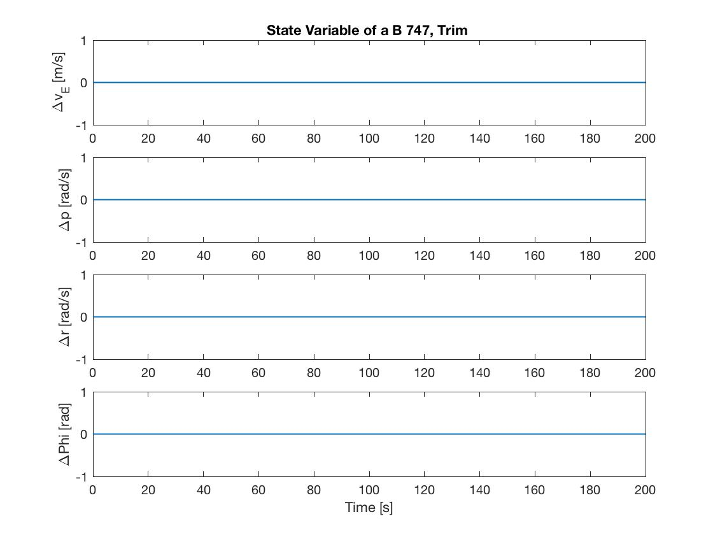
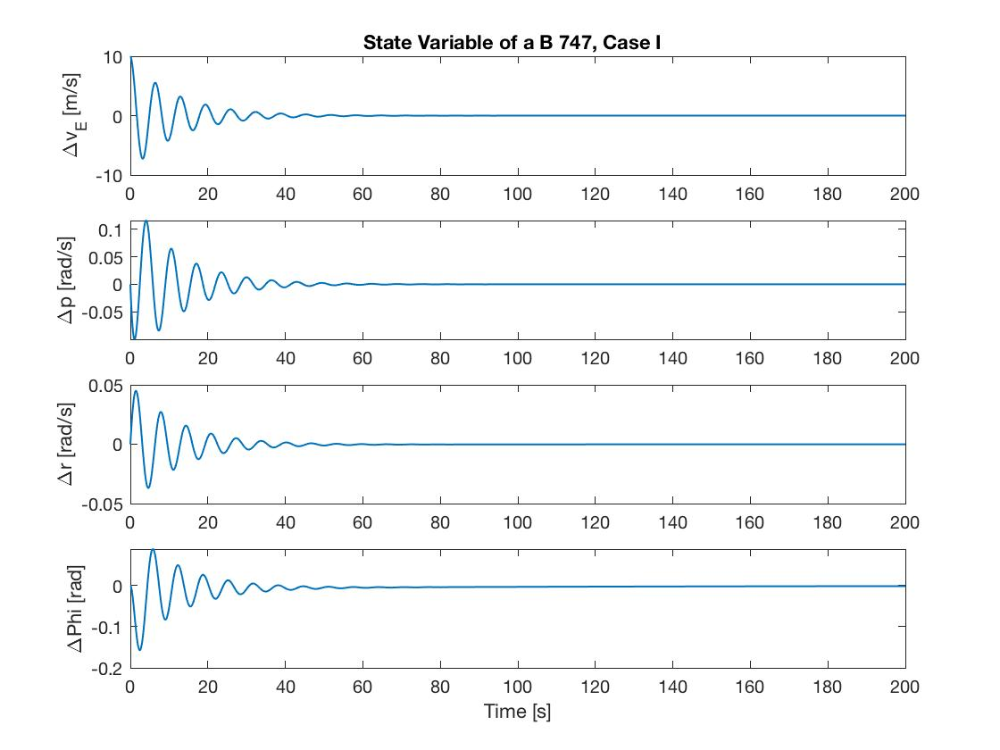
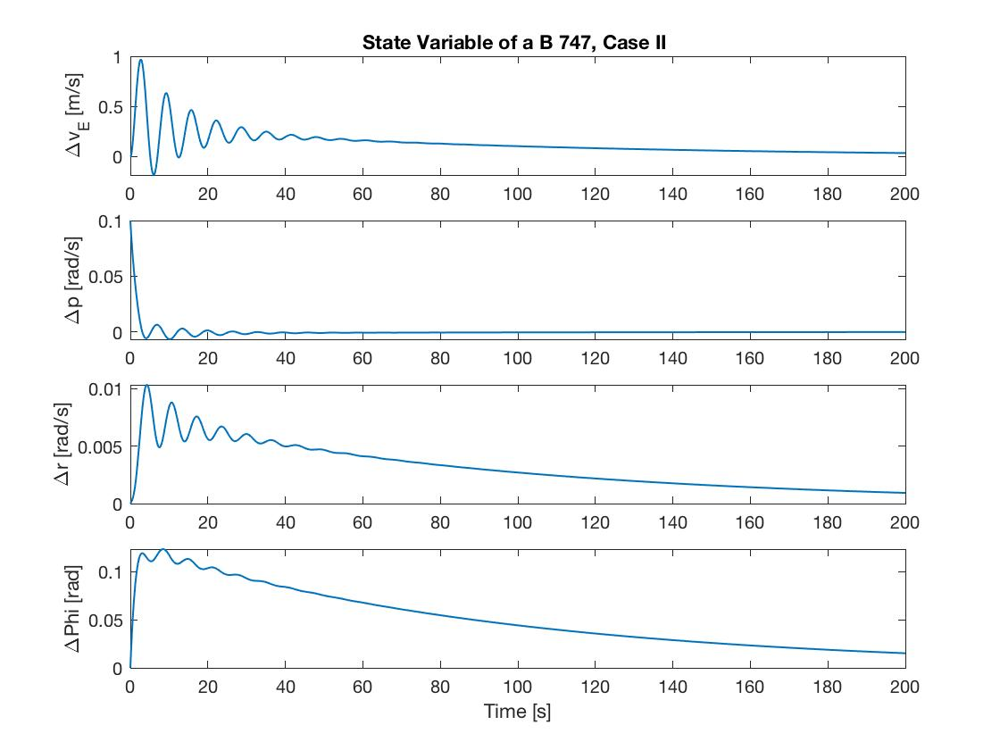
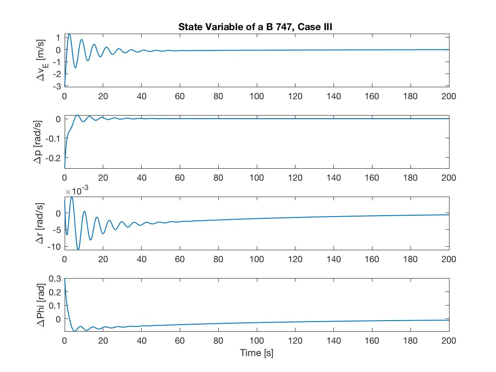
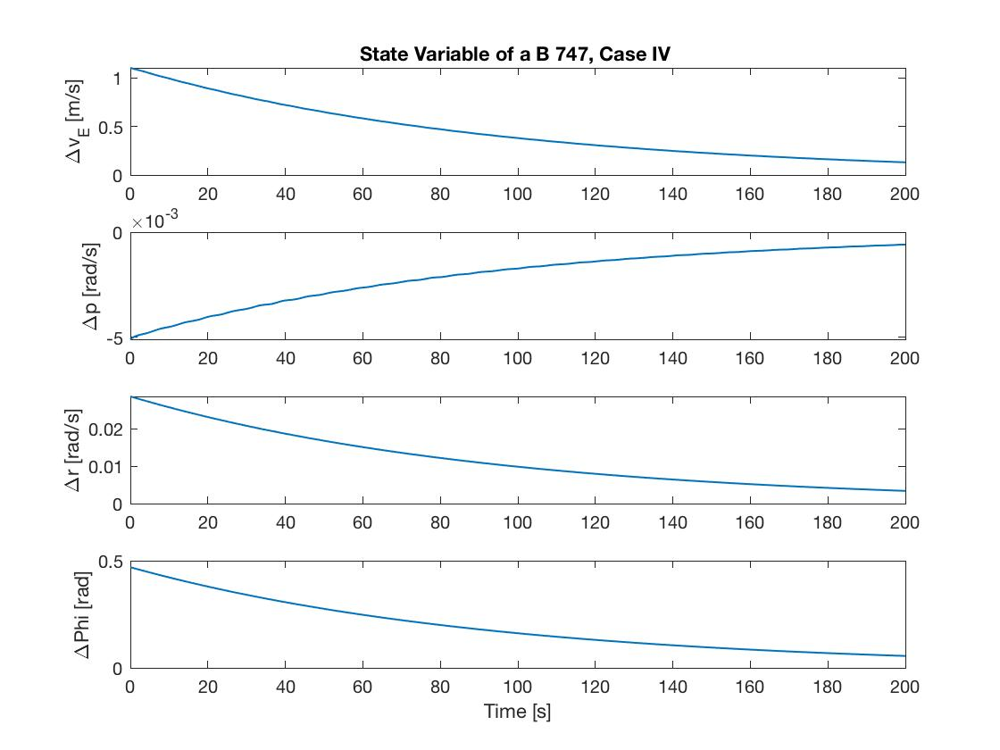

# ASEN 3128 Homework 10}

## Question 1 - Dimensional Stability Derivatives:
Using the non-dimensional Stability coefficient data from Table 6.6 in the textbook, together with the data in Table E.1 in Appendix Em for case II of a Boeing 747 airplane, the following dimensional stability derivatives were found:

### **Lateral Dimensional Derivatives:**
|           |  Y (N) | L (Nm)  | N (Nm)  |
|:---------:|:------:|:-------:|:-------:|
| v(m/s)    | -23092 | -4.39e5 | 3.06e5  | 
| p (rad/s) | 0      | -1.54e7 | -1.91e6 |
| r (rad/s) | 0      | 1.42e7  | -1.28e7 |

## Question 2 - A Matrix:
### **Part a.)**
Implementing the conditions of a Boeing 747 flying at an altitude of 20,000 feet, using the values provided from Table E.1 for case II, the full A matrix is provided below: 

$$
A =
\begin{vmatrix}

    -0.0800  &  0   &   -157.9   &  9.81 \\
     -0.01843 & -0.619 & 0.604 & 0 \\
    0.00558  & 0.00610  & -0.225  & 0 \\
            0   & 1  & 0 & 0 \\
\end{vmatrix}
$$
 

## Question 3:
When taking the eigenvalues of the lateral dynamics A matrix, it was seen that there are three different modes, constituted of the roll, spiral, and dutch roll modes. To identify which eigenvalues corresponded to which modes, the use real and imaginary parts of the eigenvectors were used. Since the only mode that had imaginary parts and inherently, a complex conjugate pair of eigenvalues, was the Dutch roll. The roll mode was noticed to be the eigenvalues with the larger negative real parts and the spiral mode was the mode with the smaller real imaginary parts. using these classifications the following expressions were used to calculate the natural frequency, dampening ratio, and time constant:  

$$
\omega_n = \sqrt{\omega^2 + n^2} \qquad \qquad \zeta = -\frac{n}{\omega_n} \qquad \qquad \tau = -\frac{1}{n}
$$
 

Where n and $\omega$ are the real and imaginary parts of the eigenvalues, respectively. The numerical values for the variables above for both the phugoid and short period mode are provided below: 

<ins>Dutch Roll Mode:</ins> 

$$
Eigenvector_1 =
\begin{vmatrix}
  0.9997 + 0.0000i \\
  -0.0104 - 0.0127i \\
  0.0009 + 0.0056i \\
   0.0139 - 0.0096i \\
\end{vmatrix}
\qquad
Eigenvector_2 =
\begin{vmatrix}
 0.9997 + 0.0000i \\
  -0.0104 + 0.0127i \\
   0.0009 - 0.0056i  \\
   0.0139 + 0.0096i  \\
\end{vmatrix}
$$
 

$$
\lambda_{1,2}:-0.0838 \pm 0.9709i \qquad \omega_n: 0.9745 [rad/s] \qquad \zeta: 0.086 \qquad \tau: 11.94 [s]
$$ 
 

<ins>Roll Mode:</ins>
$$
Eigenvector_1 =
\begin{vmatrix}
  -0.9441 \\
  -0.1969 \\
  0.0124 \\
  0.2641\\
\end{vmatrix}
\qquad \lambda: -0.7455 \qquad \tau: 1.341 [s]
$$
 

<ins> Spiral Mode: </ins>

$$
Eigenvector_1 =
\begin{vmatrix}
  0.9201 \\
  -0.0042 \\
  0.0239 \\
   0.3908 \\
\end{vmatrix}
\qquad \lambda: -0.0107 \qquad \tau: 93.71 [s] \qquad 
$$
 

## Question 4:
Using the simplifications for the dutch roll dynamics approximation the following eigenvalues:  

$$
\lambda_{1,2}: -0.1524 \pm 0.9360i
$$
 

When comparing the eigenvalues of the dutch roll approximation in comparison to the full lateral dynamics model it was noticed that the real part of the eigenvalues for the approximation had larger negative real parts. This meaning that the approximation would damp the system faster as the real part drives the envelope, which has larger negative parts, therefore, would return to trim much faster. The complex parts of the eigenvalues were relatively close, meaning that the time constants would be similar.  

## Question 5:
% Part a
### **Part a.)**
Simulating the full linearized lateral dynamics model, the response of Boeing 747 at trim is plotted below:  

**Trim:**  

 

As can be see by the state variable response, the trim state is an equilibrium state as the state variable all stay at their nominal conditions of trim. 

### **Part b.)**
Implementing the same full linearized lateral dynamics model as in part a, but this time with perturbations about trim the following results are plotted below. Perturbations are defined about the state vector in the following scenarios as - $y(0) = [\Delta v(0), \Delta p(0), \Delta r(0), \Delta \phi(0)]^T$ - with units in SI.  

**Case I - $y(0) = [10, 0, 0, 0]^T$:**

 

**Case II - $y(0) = [0, 0.1, 0, 0]^T$:** 

 

**Case III - $y(0) = [-3.0747, -0.2556, 0.0038, 0.3015]^T$:**

 

**Case IV - $y(0) = [1.1039, -0.0051, 0.0287, 0.4697]^T$:**

 

### **Part c.)** 
As can be seen by the response of the system, the spiral mode is excited by deviations in yaw rate, roll rate, and . The spiral mode can be easily seen as it is the least damped mode and therefore is represented in the plots by the slow return of the state variables to nominal. The roll mode has no complex parts, which is why it does not oscillate about the envelope. This makes sense since the side slip velocity, roll rate, and bank angle barely change in a spiral motion, where yaw is drastically changing. The roll mode is illustrated in the plots in a similar way to the spiral mode as it also has no complex parts, therefore has no oscillatory motion. The roll mode is more damped than the spiral mode, therefore returns to nominal conditions much faster than the spiral mode. This mode is seen to be excited by perturbations in roll. Lastly, the dutch roll mode is easy to identify as well since it is the only mode with complex conjugate pairs. This means that the response has oscillatory motion. This mode is seen to excited by deviations in side slip velocity, roll rate, and yaw rate. This mode is a cause of coupling in the state variable which is why it makes sense that all the state variables can excite it.